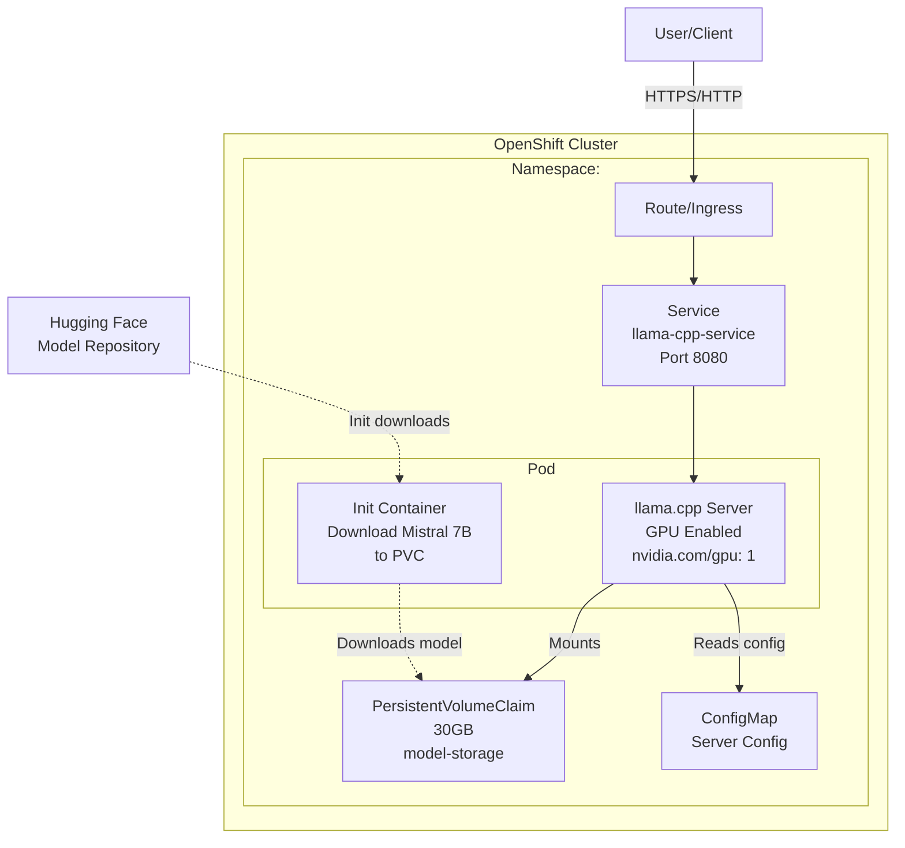

# Mistral 7B Deployment Plan with llama.cpp on OpenShift AI

## Overview
Deploy Mistral 7B model using llama.cpp server on OpenShift with GPU acceleration in the `<your-namespace>` namespace.

## Architecture



## Components

### 1. Namespace
- **Name**: `<your-namespace>`
- **Purpose**: Isolate all llama.cpp resources

### 2. PersistentVolumeClaim (PVC)
- **Size**: 30GB
- **Access Mode**: ReadWriteOnce
- **Purpose**: Store Mistral 7B model files (GGUF format)
- **Mount Path**: `/models`

### 3. ConfigMap
- **Purpose**: Store llama.cpp server configuration
- **Contents**: 
  - Model parameters (context size, threads, GPU layers)
  - Server settings (host, port)

### 4. Init Container
- **Image**: `curlimages/curl` or similar
- **Purpose**: Download Mistral 7B GGUF model from Hugging Face
- **Model Source**: TheBloke/Mistral-7B-Instruct-v0.2-GGUF
- **Target**: Quantized version (Q4_K_M recommended for balance)

### 5. Main Container (llama.cpp Server)
- **Image**: `ghcr.io/ggerganov/llama.cpp:server` (with CUDA support)
- **GPU Resources**: 
  - Request: 1 GPU
  - Limit: 1 GPU
  - Toleration for GPU nodes
- **Ports**: 8080 (HTTP API)
- **Environment Variables**:
  - Model path
  - GPU layers to offload
  - Context size
  - Number of threads

### 6. Service
- **Type**: ClusterIP
- **Port**: 8080
- **Target Port**: 8080
- **Purpose**: Internal access to llama.cpp API

### 7. Route (Optional)
- **Purpose**: External access to the API
- **TLS**: Edge termination recommended
- **Host**: Auto-generated or custom

## Deployment Steps

1. **Create Namespace**
   ```bash
   oc create namespace <your-namespace>
   oc project <your-namespace>
   ```

2. **Apply PVC**
   - Creates storage for model files

3. **Apply ConfigMap**
   - Sets llama.cpp server parameters

4. **Apply Deployment**
   - Init container downloads model
   - Main container starts llama.cpp server with GPU

5. **Apply Service**
   - Exposes llama.cpp API internally

6. **Apply Route (Optional)**
   - Enables external access

7. **Verify Deployment**
   - Check pod status
   - Test API endpoints
   - Validate GPU usage

## API Endpoints

Once deployed, the llama.cpp server provides:

- **POST /completion**: Generate text completions
- **POST /v1/chat/completions**: OpenAI-compatible chat API
- **GET /health**: Health check endpoint
- **GET /models**: List loaded models

## Resource Requirements

- **CPU**: 4 cores (request), 8 cores (limit)
- **Memory**: 16Gi (request), 24Gi (limit)
- **GPU**: 1x NVIDIA GPU (A10, V100, or better recommended)
- **Storage**: 30GB PVC

## Model Details

- **Model**: Mistral 7B Instruct v0.2
- **Format**: GGUF (quantized)
- **Quantization**: Q4_K_M (4-bit, ~4GB size)
- **Context Length**: 8192 tokens (configurable)
- **GPU Layers**: 35 (offload all layers to GPU)

## Security Considerations

- NetworkPolicies for traffic control
- RBAC for namespace access
- Secrets for any API keys (if needed)
- TLS for external routes

## Monitoring

- Pod logs for llama.cpp output
- GPU utilization metrics
- API response times
- Model inference latency

## Next Steps

After reviewing this plan, we can proceed to implementation by switching to Code mode to create all the Kubernetes manifests and deployment scripts.